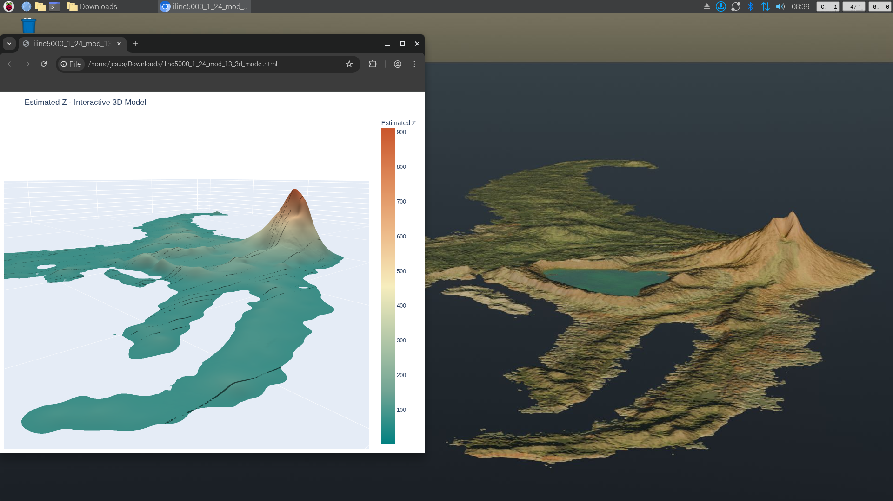

Raspberry Pi 5 Optimization
===========================

pyGEKO is uniquely designed to handle spatial interpolation on edge devices. However, ARM architectures require specific considerations to maintain stability and performance.

   
   **Interactive 3D model vs. Blender render on Raspberry Pi 5 desktop.**

Thread Control
--------------

By default, libraries like NumPy and OpenBLAS try to use all available threads. On a Raspberry Pi, this can cause "thread thrashing," where the CPU spends more time switching tasks than calculating, leading to system freezes.

**pyGEKO automatically limits NumPy to a single thread per process.** This ensures that when we use parallel processing via ``Joblib``, each physical core handles exactly one estimation task, maximizing throughput without overheating.

Headless Visualization (VNC)
----------------------------

If you are running the Pi "headless" (without a monitor), traditional Matplotlib windows might fail. Use the GPU-accelerated viewer:

.. code-block:: python

   from pygeko import Gplot
   gp = Gplot("result_base")
   
   # This generates a WebGL HTML file and opens it in the browser
   # It is much smoother over VNC than standard windows
   gp.zsurf_gpu()

Best Practices for Pi 5
-----------------------

1.  **Cooling:** Even with optimizations, Kriging is CPU-intensive. Use an active cooler (Official Active Cooler or Argon case).
2.  **Memory:** For datasets over 50,000 points, ensure you are using the 4GB or 8GB RAM version of the Pi 5.
3.  **Power:** Use the official 5V 5A power supply to prevent voltage drops during high-load parallel estimation.
