# 📖 Tutorial


## Intro

The functionality of `pyGEKO` is contained in the following classes:

* `Kdata` management and analysis of input data
* `Kgrid` interpolation over a rectangular area (grid)
* `Gplot` basic graphical functions for a quick exploration of `Kgrid` results

whose use will be illustrated in this tutorial with the help of two datasets:

|Dataset|Filename|Points|
|---|---|---|
|Mount Bear|[montebea.csv](https://github.com/jccsvq/pygeko/blob/main/src/pygeko/testdata/montebea.csv)|87|
|Mount S. Helens|[msh5000.csv](https://github.com/jccsvq/pygeko/blob/main/src/pygeko/testdata/msh5000.csv)|5000|

Both datasets are included in the package, so you won't need to download them. We'll use the first one throughout this tutorial because its small size will make calculations quick, and we'll reserve the second one for stress testing.

## `Kdata` use

### Input data

`Kdata` uses a `CSV` file as input. This file must contain columns with the X and Y coordinates of the points and another with the Z values ​​of the variable to be interpolated. Throughout this tutorial, we will first use the test data contained in the `montebea.csv` file, the first rows of which are:

```bash
$ head montebea.csv

id,heigth,easting,northing
1,1430.0,150.0,1278.0
2,1410.0,228.0,1182.0
3,1510.0,292.0,1284.0
4,1795.0,409.0,1350.0
5,1743.0,400.0,1268.0
6,1600.0,378.0,1216.0
7,1815.0,460.0,1219.0
8,1897.0,508.0,1318.0
9,1760.0,549.0,1223.0
```

and we will reserve `msh5000.csv` for stress testing.

```bash
$ head msh5000.csv 

X,Y,Z
753.0,219.0,23689.0
671.0,125.0,16955.0
622.0,175.0,18778.0
303.0,560.0,29703.0
150.0,320.0,20719.0
663.0,716.0,24650.0
817.0,764.0,15174.0
12.0,711.0,21773.0
664.0,765.0,20776.0
```


### Basic workflow

The core of `Kdata` is a [`pandas.DataFrame`](https://pandas.pydata.org/docs/reference/api/pandas.DataFrame.html) object; in fact, all the arguments used in the creation of a `Kdata` object are passed directly to [`pandas.read_csv()`](https://pandas.pydata.org/docs/reference/api/pandas.read_csv.html#pandas.read_csv), so that you can use all the functionality of this method to read your `CSV` files. Furthermore, `Kdata` inherits all the attributes of `pandas.DataFrame` so that you can analyze and modify your data just as you would with `pandas`. Let's proceed to create a `Kdata` object:

Create a working directory for your tests and access it with the `cd` command, then run the `pygeko` command. `pygeko` is a custom `python3` interpreter that already has the three classes from this package imported and contains some additional definitions.

```bash
$ pygeko

Welcome to pyGEKO-Kriger 0.9.0
Generalized Covariance Kriger
    
Classes Kdata, Kgrid and Gplot imported.

Use exit() or Ctrl-D (i.e. EOF) to exit.

-->
```

(`--> ` is the prompt) Let us create our first `Kdata` object. If the file `montebea.csv` were in our directory we would use:

```bash
--> kd = Kdata("montebea.csv")
```

but the file has been installed with the distribution in some other location which we can find in the `montebea` variable within `pygeko`:

```bash
--> montebea
'/home/jesus/Nextcloud/gck/src/pygeko/testdata/montebea.csv' # Almost sure you see a different path!
```
so we write:

```bash
--> kd = Kdata(montebea)
Column names default to "X", "Y" and "Z"
nvec dafaults to: 12 and nork to: 1
Please, adapt these parameter to your problem!

--> 
```

> Please note that we received an alert regarding default assumptions made by `Kdata`. We will return to this soon.

Let's explore our object:

```bash
--> kd.status

Data properties:
              id       heigth     easting     northing
count  87.000000    87.000000   87.000000    87.000000
mean   44.000000  1455.034483  529.977011   721.977011
std    25.258662   266.054263  287.419836   410.964973
min     1.000000   800.000000   34.000000    42.000000
25%    22.500000  1271.000000  294.500000   372.000000
50%    44.000000  1500.000000  539.000000   682.000000
75%    65.500000  1616.000000  775.000000  1099.000000
max    87.000000  2030.000000  992.000000  1390.000000

Setting:
x_col: X
y_col: Y
z_col: Z
 nork: 1
 nvec: 12
Scale: None


-->
```

Our X, Y, and Z data are contained in the `easting`, `northing`, and `height` columns. Let's heed the alert received and inform `Kdata` that we wish to use these columns in our problem:

```bash
--> kd.x_col = "easting"    # which column of the dataset to use as X
--> kd.y_col = "northing"   # which column of the dataset to use as Y
--> kd.z_col = "heigth"     # which column of the dataset to use as Z
--> 
```

Let'us explore again:

```bash
--> kd.status

Data properties:
              id       heigth     easting     northing
count  87.000000    87.000000   87.000000    87.000000
mean   44.000000  1455.034483  529.977011   721.977011
std    25.258662   266.054263  287.419836   410.964973
min     1.000000   800.000000   34.000000    42.000000
25%    22.500000  1271.000000  294.500000   372.000000
50%    44.000000  1500.000000  539.000000   682.000000
75%    65.500000  1616.000000  775.000000  1099.000000
max    87.000000  2030.000000  992.000000  1390.000000

Setting:
x_col: easting
y_col: northing
z_col: heigth
 nork: 1
 nvec: 12
Scale: None


--> 
```

There were two other default values ​​mentioned in the alert: `nork` and `nvec`

* `nork` polynomial drift order
* `nvec` number of neighbors to use

We could change them using:

```bash
--> kd.nork = 2
--> kd.nvec = 14
```

but for now we'll leave them as they are.

(If you're curious why these integer variables start with "n", the answer lies in the `Fortran` used by the author in the late 1980s to code this algorithm. See the [`gck` project](https://github.com/jccsvq/gck) for more details.)

We can visualize our data with two graphical previews:

```bash
--> kd.plot()
```

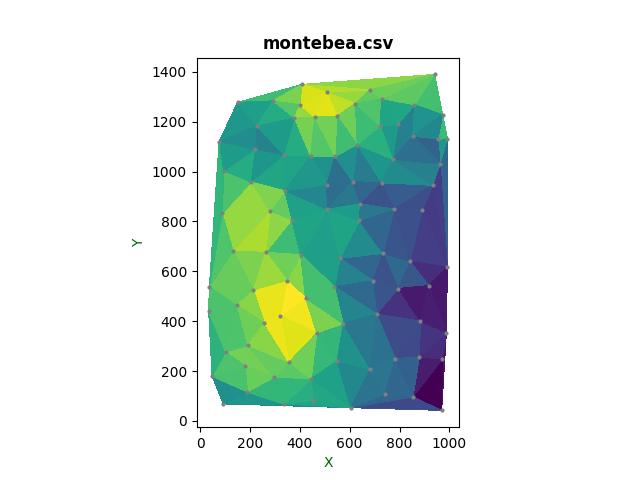

```bash
--> kd.trisurf()
```

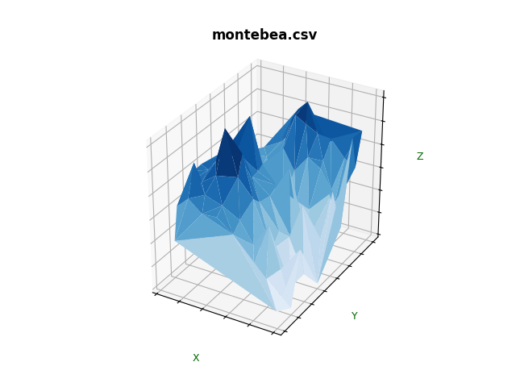


### A note on generalized covariance models

The mathematical foundations of the kriging method used in this package, using generalized increments of order *k* and generalized covariance models, are briefly explained in [Topography of the Galactic Disk: Z Structure and Large-Scale Star Formation](https://ui.adsabs.harvard.edu/abs/1991ApJ...378..106A/abstract),work from which this project is inherited (see the [`gck`](https://github.com/jccsvq/gck) project on GitHub if you are curious). The generalized covariance model used is of the form:

$$K(h)=\sum_{k=0}^{4} Z_k\cdot K_k(h)$$

where $Z_k$ are the **model parameters** (`zk` variable in the source files) and $K_k$ are the monomials:

|Monomials|
|---
|$K_0 = \delta (h)$|
|$K_1 = h$|
|$K_2 = h^3$|
|$K_3 = h^5$|
|$K_4 = h^2 \log(h)$|

>$K_0=\delta(h)$ is the *nugget* term with $\delta(0)=1$ and $\delta(h)=0$ for $h>0$.

`pyGEKO` explores the use of the 21 models defined in the table below, where 1 represents the use of each monomial and 0 its exclusion:

|Model Number|$K_0$|$K_1$|$K_2$|$K_3$|$K_4$|
|---|---|---|---|---|---|
|0|1|0|0|0|0|
|1|0|1|0|0|0|
|2|0|0|1|0|0|
|3|0|0|0|1|0|
|4|0|0|0|0|1|
|5|1|1|0|0|0|
|6|1|0|1|0|0|
|7|1|0|0|1|0|
|8|1|0|0|0|1|
|9|0|1|1|0|0|
|10|0|1|0|1|0|
|11|0|1|0|0|1|
|12|0|0|1|1|0|
|13|0|0|1|0|1|
|14|1|1|1|0|0|
|15|1|1|0|1|0|
|16|1|1|0|0|1|
|17|0|1|1|1|0|
|18|0|1|1|0|1|
|19|1|1|1|1|0|
|20|1|1|1|0|1|

### Manual analysis

Once we have created and configured our `Kdata` object, we can proceed to analyze it using the `.analyze()` method. This will generate generalized increments of order *k* from the data points and fit the 21 generalized covariance models, testing them by a **leave-one-out cross-validation** method. This method accepts one boolean parameter to decide whether to present a preview of what the krigin of our data would be with the best model found for the values ​​of `nork` and `nvec` used. If you're eager to see what your first kriging results using generalized covariances would look like, make sure you set the switch to True!

```bash
--> kd.analyze(preview=True)
Executing isolated analysis (NORK=1, NVEC=12)...
Mod  | MAE        | RMSE       | Corr     | Status
--------------------------------------------------
0    | 131.0157   | 170.1328   | 0.7599   | OK
1    | 123.0204   | 169.7489   | 0.7600   | OK
2    | 140.0318   | 199.4235   | 0.7002   | OK
3    | 312.3967   | 609.6041   | 0.2972   | OK
4    | 130.0814   | 183.6116   | 0.7321   | OK
5    | 123.0204   | 169.7489   | 0.7600   | OK
6    | 140.0318   | 199.4235   | 0.7002   | OK
7    | 312.3967   | 609.6041   | 0.2972   | OK
8    | 130.0814   | 183.6116   | 0.7321   | OK
9    | 123.0204   | 169.7489   | 0.7600   | OK
10   | 123.0204   | 169.7489   | 0.7600   | OK
11   | 123.0038   | 169.7019   | 0.7601   | OK
12   | 140.0314   | 199.4229   | 0.7002   | OK
13   | 130.0617   | 183.5821   | 0.7322   | OK
14   | 123.0204   | 169.7489   | 0.7600   | OK
15   | 123.0204   | 169.7489   | 0.7600   | OK
16   | 123.0038   | 169.7019   | 0.7601   | OK
17   | 123.0196   | 169.7471   | 0.7600   | OK
18   | 122.9569   | 169.5708   | 0.7604   | OK
19   | 123.0196   | 169.7471   | 0.7600   | OK
20   | 122.9569   | 169.5708   | 0.7604   | OK

Validating best model...
Starting Cross-Validation in 87 points...

--- CROSS-VALIDATION SUMMARY ---
Validated points: 85 / 87
Mean Absolute Error (MAE): 122.9569
Root Mean Square Error (RMSE): 169.5708
Correlation Coefficient: 0.7604

[OK] Saved: montebea_1_12.gck
     MAE: 122.95693486762474 | nork: 1 | nvec: 12
Interpolating 50x50 grid...
-->
```

The preview image should open in a new window:


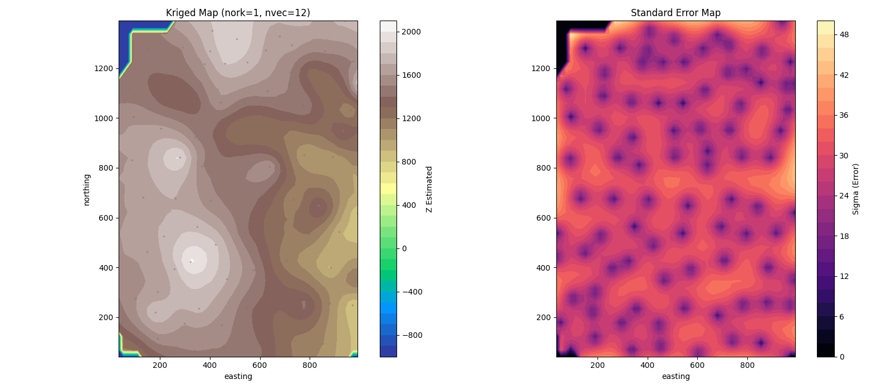

This image is a preview of what you can get with `Kgrid`.

Once you close the image, let'us explore again our object:

```bash
--> kd.status

Data properties:
              id       heigth     easting     northing
count  87.000000    87.000000   87.000000    87.000000
mean   44.000000  1455.034483  529.977011   721.977011
std    25.258662   266.054263  287.419836   410.964973
min     1.000000   800.000000   34.000000    42.000000
25%    22.500000  1271.000000  294.500000   372.000000
50%    44.000000  1500.000000  539.000000   682.000000
75%    65.500000  1616.000000  775.000000  1099.000000
max    87.000000  2030.000000  992.000000  1390.000000

Setting:
x_col: easting
y_col: northing
z_col: heigth
 nork: 1
 nvec: 12
Scale: 134.8

Cross validation data follows:

RANK  | MOD  | MAE        | RMSE       | CORR     | ZK (Coefficients)
----------------------------------------------------------------------------------------------------
★ 1   | 20   | 122.9569   | 169.5708   | 0.7604   | [-2.95e-15 -1.78e+03 3.98e-02 0.00e+00 -1.60e+01]
  2   | 18   | 122.9569   | 169.5708   | 0.7604   | [0.00e+00 -1.78e+03 3.98e-02 0.00e+00 -1.60e+01]
  3   | 16   | 123.0038   | 169.7019   | 0.7601   | [2.01e-16 -4.49e+02 0.00e+00 0.00e+00 -1.07e+00]
  4   | 11   | 123.0038   | 169.7019   | 0.7601   | [0.00e+00 -4.49e+02 0.00e+00 0.00e+00 -1.07e+00]
  5   | 17   | 123.0196   | 169.7471   | 0.7600   | [0.00e+00 -5.34e+02 -1.26e-02 3.89e-08 0.00e+00]
  6   | 19   | 123.0196   | 169.7471   | 0.7600   | [-1.77e-16 -5.34e+02 -1.26e-02 3.89e-08 0.00e+00]
  7   | 9    | 123.0204   | 169.7489   | 0.7600   | [0.00e+00 -2.80e+02 -5.90e-05 0.00e+00 0.00e+00]
  8   | 14   | 123.0204   | 169.7489   | 0.7600   | [4.93e-17 -2.80e+02 -5.90e-05 0.00e+00 0.00e+00]
  9   | 5    | 123.0204   | 169.7489   | 0.7600   | [-5.60e-17 -2.79e+02 0.00e+00 0.00e+00 0.00e+00]
  10  | 1    | 123.0204   | 169.7489   | 0.7600   | [0.00e+00 -2.79e+02 0.00e+00 0.00e+00 0.00e+00]
  11  | 15   | 123.0204   | 169.7489   | 0.7600   | [-2.30e-17 -2.54e+02 0.00e+00 1.23e-08 0.00e+00]
  12  | 10   | 123.0204   | 169.7489   | 0.7600   | [0.00e+00 -2.54e+02 0.00e+00 1.23e-08 0.00e+00]
  13  | 0    | 131.0157   | 170.1328   | 0.7599   | [-2.80e+19 0.00e+00 0.00e+00 0.00e+00 0.00e+00]
  14  | 13   | 130.0617   | 183.5821   | 0.7322   | [0.00e+00 0.00e+00 -3.40e-03 0.00e+00 2.24e+00]
  15  | 4    | 130.0814   | 183.6116   | 0.7321   | [0.00e+00 0.00e+00 0.00e+00 0.00e+00 1.65e+00]
  16  | 8    | 130.0814   | 183.6116   | 0.7321   | [-2.23e-21 0.00e+00 0.00e+00 0.00e+00 1.65e+00]
  17  | 12   | 140.0314   | 199.4229   | 0.7002   | [0.00e+00 0.00e+00 9.23e-03 -2.99e-09 0.00e+00]
  18  | 2    | 140.0318   | 199.4235   | 0.7002   | [0.00e+00 0.00e+00 8.89e-03 0.00e+00 0.00e+00]
  19  | 6    | 140.0318   | 199.4235   | 0.7002   | [-7.68e-26 0.00e+00 8.89e-03 0.00e+00 0.00e+00]
  20  | 3    | 312.3967   | 609.6041   | 0.2972   | [0.00e+00 0.00e+00 0.00e+00 3.38e-08 0.00e+00]
  21  | 7    | 312.3967   | 609.6041   | 0.2972   | [-2.11e-36 0.00e+00 0.00e+00 3.38e-08 0.00e+00]
----------------------------------------------------------------------------------------------------
Best model is #20.


--> 
```
We observe some changes here.

* First, there is a `Scale` property that is used in the calculations to stabilize the covariance matrix. 
* Second, we now have the result of adjusting all the models and the indication of the optimum (lowest MAE value), in this case at #20.

`analyze` is a time-intensive function, its cost depending linearly on the number of points in the dataset. To avoid tedious recalculations, you can use the `save` and `restore` methods, which will write the results to a `.gck` file that can be used at any time to reconstruct the `Kdata` object.

```bash
--> kd.save()

[OK] Saved: montebea_1_12.gck
     MAE: 122.95693486762474 | nork: 1 | nvec: 12
--> 
```

To see how this file may be used let's create a second object using `recover`

```bash
--> kd2=Kdata("montebea.csv")
Column names default to "X", "Y" and "Z"
nvec dafaults to: 12 and nork to: 1
Please, adapt these parameter to your problem!
>>> kd2.restore("montebea_1_12.gck")

[RESTORE] Configuration recovered:
          Model: 20 | nork: 1 | nvec: 12
          Original validation: MAE=122.95693486762474
          KDTree regenerated for 87 points.
--> 
```

Let'us explore `kd2`:


```bash
--> kd2.status

Data properties:
              id       heigth     easting     northing
count  87.000000    87.000000   87.000000    87.000000
mean   44.000000  1455.034483  529.977011   721.977011
std    25.258662   266.054263  287.419836   410.964973
min     1.000000   800.000000   34.000000    42.000000
25%    22.500000  1271.000000  294.500000   372.000000
50%    44.000000  1500.000000  539.000000   682.000000
75%    65.500000  1616.000000  775.000000  1099.000000
max    87.000000  2030.000000  992.000000  1390.000000

Setting:
x_col: easting
y_col: northing
z_col: heigth
 nork: 1
 nvec: 12
Scale: 134.8

Cross validation data follows:

RANK  | MOD  | MAE        | RMSE       | CORR     | ZK (Coefficients)
----------------------------------------------------------------------------------------------------
★ 1   | 20   | 122.9569   | 169.5708   | 0.7604   | [-2.95e-15 -1.78e+03 3.98e-02 0.00e+00 -1.60e+01]
  2   | 18   | 122.9569   | 169.5708   | 0.7604   | [0.00e+00 -1.78e+03 3.98e-02 0.00e+00 -1.60e+01]
  3   | 16   | 123.0038   | 169.7019   | 0.7601   | [2.01e-16 -4.49e+02 0.00e+00 0.00e+00 -1.07e+00]
  4   | 11   | 123.0038   | 169.7019   | 0.7601   | [0.00e+00 -4.49e+02 0.00e+00 0.00e+00 -1.07e+00]
  5   | 17   | 123.0196   | 169.7471   | 0.7600   | [0.00e+00 -5.34e+02 -1.26e-02 3.89e-08 0.00e+00]
  6   | 19   | 123.0196   | 169.7471   | 0.7600   | [-1.77e-16 -5.34e+02 -1.26e-02 3.89e-08 0.00e+00]
  7   | 9    | 123.0204   | 169.7489   | 0.7600   | [0.00e+00 -2.80e+02 -5.90e-05 0.00e+00 0.00e+00]
  8   | 14   | 123.0204   | 169.7489   | 0.7600   | [4.93e-17 -2.80e+02 -5.90e-05 0.00e+00 0.00e+00]
  9   | 5    | 123.0204   | 169.7489   | 0.7600   | [-5.60e-17 -2.79e+02 0.00e+00 0.00e+00 0.00e+00]
  10  | 1    | 123.0204   | 169.7489   | 0.7600   | [0.00e+00 -2.79e+02 0.00e+00 0.00e+00 0.00e+00]
  11  | 15   | 123.0204   | 169.7489   | 0.7600   | [-2.30e-17 -2.54e+02 0.00e+00 1.23e-08 0.00e+00]
  12  | 10   | 123.0204   | 169.7489   | 0.7600   | [0.00e+00 -2.54e+02 0.00e+00 1.23e-08 0.00e+00]
  13  | 0    | 131.0157   | 170.1328   | 0.7599   | [-2.80e+19 0.00e+00 0.00e+00 0.00e+00 0.00e+00]
  14  | 13   | 130.0617   | 183.5821   | 0.7322   | [0.00e+00 0.00e+00 -3.40e-03 0.00e+00 2.24e+00]
  15  | 4    | 130.0814   | 183.6116   | 0.7321   | [0.00e+00 0.00e+00 0.00e+00 0.00e+00 1.65e+00]
  16  | 8    | 130.0814   | 183.6116   | 0.7321   | [-2.23e-21 0.00e+00 0.00e+00 0.00e+00 1.65e+00]
  17  | 12   | 140.0314   | 199.4229   | 0.7002   | [0.00e+00 0.00e+00 9.23e-03 -2.99e-09 0.00e+00]
  18  | 2    | 140.0318   | 199.4235   | 0.7002   | [0.00e+00 0.00e+00 8.89e-03 0.00e+00 0.00e+00]
  19  | 6    | 140.0318   | 199.4235   | 0.7002   | [-7.68e-26 0.00e+00 8.89e-03 0.00e+00 0.00e+00]
  20  | 3    | 312.3967   | 609.6041   | 0.2972   | [0.00e+00 0.00e+00 0.00e+00 3.38e-08 0.00e+00]
  21  | 7    | 312.3967   | 609.6041   | 0.2972   | [-2.11e-36 0.00e+00 0.00e+00 3.38e-08 0.00e+00]
----------------------------------------------------------------------------------------------------
Best model is #20.


--> 
```

The object has been reproduced. Let's get rid of `kd2`, as we no longer need it.

```bash
--> del kd2
-->
``` 

### Analysis automation

The next and final step in this tutorial on `Kdata` is automating the previous analysis. The `.tune()` method allows us to iterate the previous process over a grid of `nork` and `nvec` values ​​and store the results in the corresponding `GCK` files, so we don't have to repeat this time-consuming process in the future.

```bash

>>> tune_report = kd.tune(nvec_list=range(8, 17, 2), nork_list=[0, 1, 2])

Starting isolated scan of 15 combinations...
[TUNING SCAN]: 100%|████████████████████████████| 15/15 [00:01<00:00, 10.90it/s]


========================================
 TUNING RESULT
========================================
Best setting: nork=1, nvec=14
Minimum MAE: 121.3317 (Model #20)
========================================

[RESTORE] Configuration recovered:
          Model: 20 | nork: 1 | nvec: 14
          Original validation: MAE=121.33169956379052
          KDTree regenerated for 87 points.


```

Now let'us try:

```bash

>>> kd.plot_tuning_results(tune_report)

[PLOT] Heatmap saved to: montebea_tuning.png
```
Now, the saved image opens in a new windows:

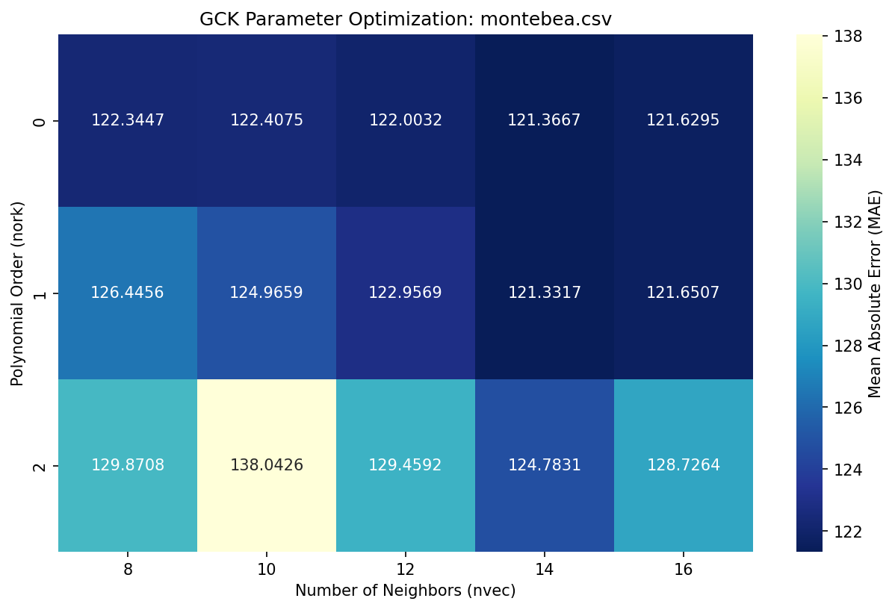

Once you close the image, open a new terminal window and let's try:

```bash
$ ls *gck
montebea_0_10.gck  montebea_0_8.gck   montebea_1_16.gck  montebea_2_14.gck
montebea_0_12.gck  montebea_1_10.gck  montebea_1_8.gck   montebea_2_16.gck
montebea_0_14.gck  montebea_1_12.gck  montebea_2_10.gck  montebea_2_8.gck
montebea_0_16.gck  montebea_1_14.gck  montebea_2_12.gck
```

and:

```bash
$ lsgck 
Scanning directory: /home/jesus/Nextcloud/gck/pruebas

=====================================================================================================
File                           | Date   | nork  | nvec  | MAE      | RMSE     | CORR     | Model     
-----------------------------------------------------------------------------------------------------
montebea_0_10.gck              | 01-02  | 0     | 10    |  122.407 |  167.426 | 0.765566 | 16        
montebea_0_12.gck              | 01-02  | 0     | 12    |  122.003 |  167.832 | 0.764883 | 11        
montebea_0_14.gck              | 01-02  | 0     | 14    |  121.367 |  167.534 | 0.766684 | 16        
montebea_0_16.gck              | 01-02  | 0     | 16    |  121.629 |  167.959 | 0.765885 | 11        
montebea_0_8.gck               | 01-02  | 0     | 8     |  122.345 |   167.89 | 0.763376 | 17        
montebea_1_10.gck              | 01-02  | 1     | 10    |  124.966 |  167.926 | 0.764731 | 0         
montebea_1_12.gck              | 01-02  | 1     | 12    |  122.957 |  169.571 | 0.760423 | 20        
montebea_1_14.gck              | 01-02  | 1     | 14    |  121.332 |  167.144 | 0.768756 | 20        
montebea_1_16.gck              | 01-02  | 1     | 16    |  121.651 |  167.421 | 0.768497 | 18        
montebea_1_8.gck               | 01-02  | 1     | 8     |  126.446 |  170.101 | 0.754191 | 0         
montebea_2_10.gck              | 01-02  | 2     | 10    |  138.043 |  181.814 | 0.716072 | 0         
montebea_2_12.gck              | 01-02  | 2     | 12    |  129.459 |  173.554 | 0.741762 | 0         
montebea_2_14.gck              | 01-02  | 2     | 14    |  124.783 |  167.688 | 0.762002 | 0         
montebea_2_16.gck              | 01-02  | 2     | 16    |  128.726 |  171.328 | 0.751042 | 0         
montebea_2_8.gck               | 01-02  | 2     | 8     |  129.871 |  171.107 | 0.750874 | 0         
=====================================================================================================

```

So after running `.tune` we end up with a series of `.gck` files containing the fitting and evaluation results of the 21 generalized covariance models for each pair of `nork` and `nvec` values ​​tested, so that, in principle, we should never have to repeat these calculations again.

### Hard test

The previous tests with 87 points are almost instantaneous on a modern computer. Let's now try repeating the process with a dataset of 5000 points. Let's start a fresh session with `pygeko` after moving to another working directory:

```bash
$ pygeko

Welcome to pyGEKO-Kriger 0.9.0
Generalized Covariance Kriger
    
Classes Kdata, Kgrid and Gplot imported.

Use exit() or Ctrl-D (i.e. EOF) to exit.

--> kd = Kdata(msh5000)
Column names default to "X", "Y" and "Z"
nvec dafaults to: 12 and nork to: 1
Please, adapt these parameter to your problem!

--> kd.status

Data properties:
                 X           Y             Z
count  5000.000000  5000.00000   5000.000000
mean    506.529200   511.33540  19371.774800
std     296.105404   298.97883  10046.028902
min       0.000000     0.00000   1142.000000
25%     249.750000   254.00000  12684.750000
50%     499.000000   509.50000  17286.500000
75%     755.000000   771.00000  23099.500000
max    1024.000000  1024.00000  63147.000000

Setting:
x_col: X
y_col: Y
z_col: Z
 nork: 1
 nvec: 12
Scale: None


--> 
```
This time, we don't need to adjust the column names since the dataset contains exactly the names X, Y, and Z. However, as we can see above, column Z contains much larger values ​​than X and Y. For kriging stability, especially for the covariance matrices involved, it's best if the Z variable is within the same order of magnitude as the coordinates. We proceed to divide column Z by 60.

```bash
--> kd.Z /= 60.0  # Normalization for numerical stability!
--> kd.status

Data properties:
                 X           Y            Z
count  5000.000000  5000.00000  5000.000000
mean    506.529200   511.33540   322.862913
std     296.105404   298.97883   167.433815
min       0.000000     0.00000    19.033333
25%     249.750000   254.00000   211.412500
50%     499.000000   509.50000   288.108333
75%     755.000000   771.00000   384.991667
max    1024.000000  1024.00000  1052.450000

Setting:
x_col: X
y_col: Y
z_col: Z
 nork: 1
 nvec: 12
Scale: None


--> 

```

we will also change the `nork` and `nvec` parameters:

```bash
--> kd.nork = 1
--> kd.nvec = 20
--> 
```

Let us have a look at data:

```bash
--> kd.plot()
```
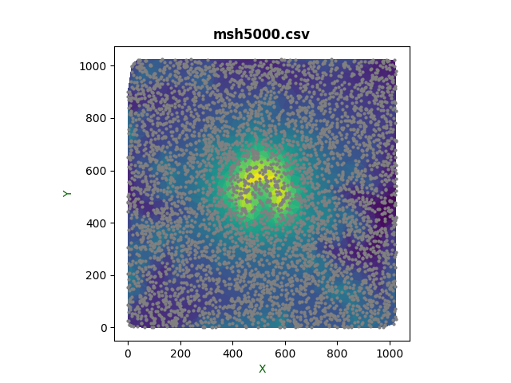

```bash
--> kd.trisurf()
```
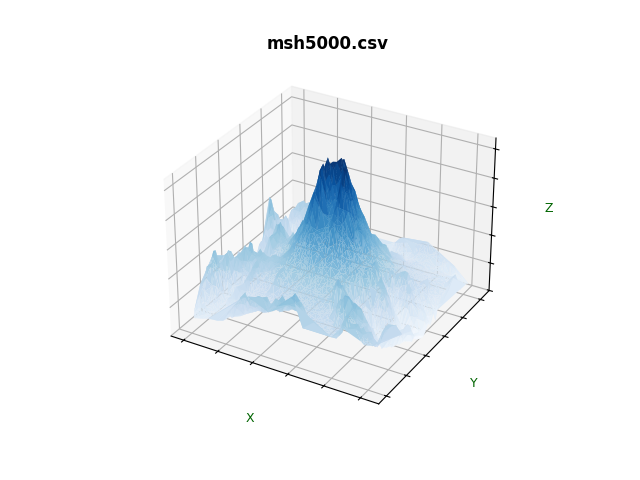

Let us proceed with `.analyze`

```bash
--> kd.analyze(preview = True)
Executing isolated analysis (NORK=1, NVEC=20)...
Mod  | MAE        | RMSE       | Corr     | Status
--------------------------------------------------
0    | 17.1245    | 25.1040    | 0.9889   | OK
1    | 6.3255     | 10.3339    | 0.9981   | OK
2    | 9.1806     | 46.2335    | 0.9639   | OK
3    | 129.9823   | 3759.8484  | 0.0437   | OK
4    | 5.6252     | 9.1849     | 0.9985   | OK
5    | 6.3255     | 10.3339    | 0.9981   | OK
6    | 9.1806     | 46.2335    | 0.9639   | OK
7    | 129.9823   | 3759.8484  | 0.0437   | OK
8    | 5.6252     | 9.1849     | 0.9985   | OK
9    | 6.3251     | 10.3331    | 0.9981   | OK
10   | 6.3255     | 10.3339    | 0.9981   | OK
11   | 6.8149     | 11.1719    | 0.9978   | OK
12   | 8.0154     | 30.4718    | 0.9837   | OK
13   | 5.6252     | 9.1848     | 0.9985   | OK
14   | 6.3251     | 10.3331    | 0.9981   | OK
15   | 6.3255     | 10.3339    | 0.9981   | OK
16   | 6.8149     | 11.1719    | 0.9978   | OK
17   | 6.3251     | 10.3330    | 0.9981   | OK
18   | 6.6013     | 10.8082    | 0.9979   | OK
19   | 6.3251     | 10.3330    | 0.9981   | OK
20   | 6.6013     | 10.8082    | 0.9979   | OK

Validating best model...
Starting Cross-Validation in 5000 points...

--- CROSS-VALIDATION SUMMARY ---
Validated points: 4999 / 5000
Mean Absolute Error (MAE): 5.6252
Root Mean Square Error (RMSE): 9.1848
Correlation Coefficient: 0.9985

[OK] Saved: msh5000_1_20.gck
     MAE: 5.625207187853923 | nork: 1 | nvec: 20
Interpolating 50x50 grid...
```
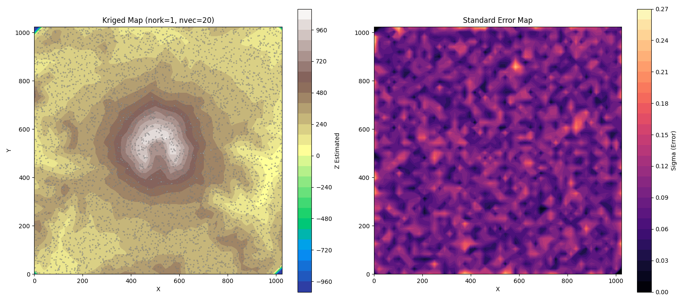

The process took considerably longer than with the Montebea dataset, about 36 seconds on an Intel i7 at 3.6 GHz and about 50 seconds on a 8 GB RAM Raspberry Pi 5. 
Now, let us *tune* Mt. St. Helens!

```bash
--> tune_report = kd.tune(nvec_list=range(14, 33, 2), nork_list=[0, 1, 2])
Starting isolated scan of 30 combinations...
[TUNING SCAN]: 100%|████████████████████████████| 30/30 [02:52<00:00,  5.76s/it]


========================================
 TUNING RESULT
========================================
Best setting: nork=1, nvec=20
Minimum MAE: 5.6252 (Model #13)
========================================

[RESTORE] Configuration recovered:
          Model: 13 | nork: 1 | nvec: 20
          Original validation: MAE=5.625207187853923
          KDTree regenerated for 5000 points.
-->
```
The progress bar indicates that the process took almost three minutes on an 8-core Intel i7 at 3.6 GHz, 
while the progress bar corresponding to the Raspberry Pi 5:

```bash
[TUNING SCAN]: 100%|████████████████████████████| 30/30 [10:17<00:00, 20.60s/it]
```
indicates about 10 minutes. These are parallel calculations; the i7 uses 8 cores while the Raspberry Pi only uses 3.

From another terminal we can see that 30 `.gck` files have been created:


```bash
$ ls *.gck
msh5000_0_14.gck  msh5000_0_30.gck  msh5000_1_26.gck  msh5000_2_22.gck
msh5000_0_16.gck  msh5000_0_32.gck  msh5000_1_28.gck  msh5000_2_24.gck
msh5000_0_18.gck  msh5000_1_14.gck  msh5000_1_30.gck  msh5000_2_26.gck
msh5000_0_20.gck  msh5000_1_16.gck  msh5000_1_32.gck  msh5000_2_28.gck
msh5000_0_22.gck  msh5000_1_18.gck  msh5000_2_14.gck  msh5000_2_30.gck
msh5000_0_24.gck  msh5000_1_20.gck  msh5000_2_16.gck  msh5000_2_32.gck
msh5000_0_26.gck  msh5000_1_22.gck  msh5000_2_18.gck
msh5000_0_28.gck  msh5000_1_24.gck  msh5000_2_20.gck
```
From another terminal:

```bash
lsgck 
Scanning directory: /home/jesus/Nextcloud/gck/pruebas/mshelen

=====================================================================================================
File                           | Date   | nork  | nvec  | MAE      | RMSE     | CORR     | Model     
-----------------------------------------------------------------------------------------------------
montebea_1_14.gck              | 01-07  | 1     | 14    |  121.332 |  167.144 | 0.768756 | 20        
msh5000_0_14.gck               | 01-07  | 0     | 14    |  5.72611 |  9.31035 | 0.998454 | 8         
msh5000_0_16.gck               | 01-07  | 0     | 16    |  5.76409 |  9.58759 |  0.99836 | 8         
msh5000_0_18.gck               | 01-07  | 0     | 18    |  5.78288 |  9.53691 | 0.998377 | 8         
msh5000_0_20.gck               | 01-07  | 0     | 20    |  5.85565 |  9.83475 | 0.998274 | 8         
msh5000_0_22.gck               | 01-07  | 0     | 22    |  6.32957 |  10.3498 | 0.998098 | 18        
msh5000_0_24.gck               | 01-07  | 0     | 24    |  6.31202 |  10.3299 | 0.998104 | 18        
msh5000_0_26.gck               | 01-07  | 0     | 26    |   6.3004 |  10.3119 |  0.99811 | 18        
msh5000_0_28.gck               | 01-07  | 0     | 28    |  6.29507 |  10.3037 | 0.998113 | 20        
msh5000_0_30.gck               | 01-07  | 0     | 30    |  6.29384 |   10.305 | 0.998112 | 18        
msh5000_0_32.gck               | 01-07  | 0     | 32    |  6.29199 |  10.3007 | 0.998113 | 18        
msh5000_1_14.gck               | 01-07  | 1     | 14    |  5.66815 |  9.23544 | 0.998479 | 13        
msh5000_1_16.gck               | 01-07  | 1     | 16    |   5.6565 |  9.21246 | 0.998486 | 13        
msh5000_1_18.gck               | 01-07  | 1     | 18    |  5.64279 |  9.21242 | 0.998486 | 13        
msh5000_1_20.gck               | 01-07  | 1     | 20    |  5.62521 |  9.18476 | 0.998495 | 13        
msh5000_1_22.gck               | 01-07  | 1     | 22    |   5.6364 |  9.20005 |  0.99849 | 13        
msh5000_1_24.gck               | 01-07  | 1     | 24    |  5.63548 |  9.19139 | 0.998492 | 13        
msh5000_1_26.gck               | 01-07  | 1     | 26    |  5.63286 |  9.18491 | 0.998494 | 13        
msh5000_1_28.gck               | 01-07  | 1     | 28    |  5.63332 |  9.18029 | 0.998496 | 13        
msh5000_1_30.gck               | 01-07  | 1     | 30    |  5.63607 |  9.18178 | 0.998495 | 13        
msh5000_1_32.gck               | 01-07  | 1     | 32    |   5.6303 |  9.17123 | 0.998499 | 13        
msh5000_2_14.gck               | 01-07  | 2     | 14    |  5.73108 |   9.3363 | 0.998444 | 13        
msh5000_2_16.gck               | 01-07  | 2     | 16    |  5.69772 |  9.30471 | 0.998455 | 13        
msh5000_2_18.gck               | 01-07  | 2     | 18    |  5.68289 |  9.28981 |  0.99846 | 13        
msh5000_2_20.gck               | 01-07  | 2     | 20    |   5.6624 |  9.24796 | 0.998474 | 8         
msh5000_2_22.gck               | 01-07  | 2     | 22    |  5.65936 |  9.23767 | 0.998477 | 4         
msh5000_2_24.gck               | 01-07  | 2     | 24    |  5.65469 |  9.23181 | 0.998479 | 13        
msh5000_2_26.gck               | 01-07  | 2     | 26    |  5.64736 |  9.20701 | 0.998487 | 13        
msh5000_2_28.gck               | 01-07  | 2     | 28    |  5.64908 |  9.20855 | 0.998487 | 13        
msh5000_2_30.gck               | 01-07  | 2     | 30    |   5.6448 |  9.20893 | 0.998486 | 13        
msh5000_2_32.gck               | 01-07  | 2     | 32    |  5.63463 |     9.19 | 0.998493 | 13        
=====================================================================================================

```

Now we obtain the heatmap:

```bash
--> kd.plot_tuning_results(tune_report)
[PLOT] Heatmap saved to: msh5000_tuning.png
```
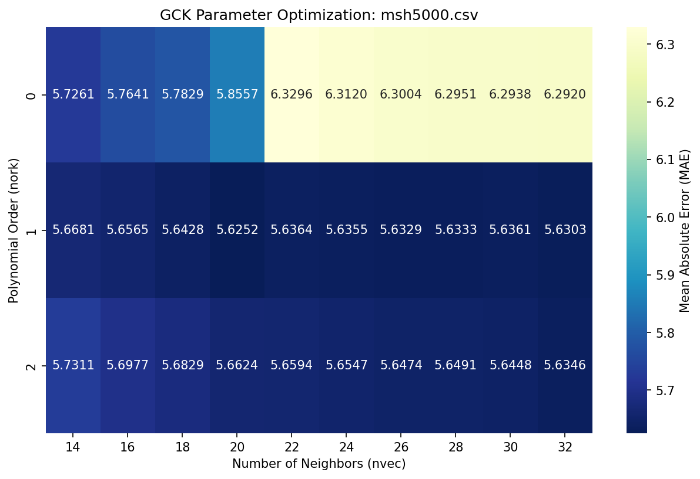

which tells us that the best combination of parameters is `nork = 1` and `nvec = 20`.

Once we have analyzed or tuned into a problem, the moment of truth arrives: kriging.

## `Kgrid` use

The `Kgrid` class handles surface kriging over a rectangular area.

### Input data

Creating a `Kgrid` object requires the following input parameters:

* The `Kdata` object (analyzed).
* The rectangular area to be covered by interpolation, defined by
  - min X
  - max X
  - min Y
  - max Y
* The grid resolution.
  - `bins`, number of X values to use.
  - `hist`, number of Y values to use.

### Basic workflow

Let's start a new `pygeko` session in the working directory where we analyzed the `montebea.csv` dataset and recreate the analyzed `Kdata` object using the `montebea_1_14.gck` file:

```bash
$ pygeko

Welcome to pyGEKO-Kriger 0.9.0
Generalized Covariance Kriger
    
Classes Kdata, Kgrid and Gplot imported.

Use exit() or Ctrl-D (i.e. EOF) to exit.

--> kd = Kdata(montebea)
Column names default to "X", "Y" and "Z"
nvec dafaults to: 12 and nork to: 1
Please, adapt these parameter to your problem!

--> kd.restore("montebea_1_14.gck")

[RESTORE] Configuration recovered:
          Model: 20 | nork: 1 | nvec: 14
          Original validation: MAE=121.33169956379052
          KDTree regenerated for 87 points.
--> kd.status

Data properties:
              id       heigth     easting     northing
count  87.000000    87.000000   87.000000    87.000000
mean   44.000000  1455.034483  529.977011   721.977011
std    25.258662   266.054263  287.419836   410.964973
min     1.000000   800.000000   34.000000    42.000000
25%    22.500000  1271.000000  294.500000   372.000000
50%    44.000000  1500.000000  539.000000   682.000000
75%    65.500000  1616.000000  775.000000  1099.000000
max    87.000000  2030.000000  992.000000  1390.000000

Setting:
x_col: easting
y_col: northing
z_col: heigth
 nork: 1
 nvec: 14
Scale: 134.8

Cross validation data follows:

RANK  | MOD  | MAE        | RMSE       | CORR     | ZK (Coefficients)
----------------------------------------------------------------------------------------------------
★ 1   | 20   | 121.3317   | 167.1441   | 0.7688   | [9.26e-16 -1.25e+03 1.95e-02 0.00e+00 -9.33e+00]
  2   | 18   | 121.3317   | 167.1441   | 0.7688   | [0.00e+00 -1.25e+03 1.95e-02 0.00e+00 -9.33e+00]
  3   | 11   | 121.3667   | 167.2586   | 0.7685   | [0.00e+00 -5.53e+02 0.00e+00 0.00e+00 -1.78e+00]
  4   | 16   | 121.3667   | 167.2586   | 0.7685   | [-5.47e-16 -5.53e+02 0.00e+00 0.00e+00 -1.78e+00]
  5   | 19   | 121.3926   | 167.3437   | 0.7683   | [-1.74e-16 -4.23e+02 -6.60e-03 1.11e-08 0.00e+00]
  6   | 17   | 121.3926   | 167.3437   | 0.7683   | [0.00e+00 -4.23e+02 -6.60e-03 1.11e-08 0.00e+00]
  7   | 9    | 121.3928   | 167.3443   | 0.7683   | [0.00e+00 -3.53e+02 -3.23e-03 0.00e+00 0.00e+00]
  8   | 14   | 121.3928   | 167.3443   | 0.7683   | [-1.48e-16 -3.53e+02 -3.23e-03 0.00e+00 0.00e+00]
  9   | 15   | 121.3930   | 167.3451   | 0.7683   | [-2.05e-19 -2.78e+02 0.00e+00 -5.41e-09 0.00e+00]
  10  | 10   | 121.3930   | 167.3451   | 0.7683   | [0.00e+00 -2.78e+02 0.00e+00 -5.41e-09 0.00e+00]
  11  | 1    | 121.3930   | 167.3451   | 0.7683   | [0.00e+00 -2.69e+02 0.00e+00 0.00e+00 0.00e+00]
  12  | 5    | 121.3930   | 167.3451   | 0.7683   | [2.17e-17 -2.69e+02 0.00e+00 0.00e+00 0.00e+00]
  13  | 0    | 136.7571   | 178.9741   | 0.7321   | [-1.97e+18 0.00e+00 0.00e+00 0.00e+00 0.00e+00]
  14  | 13   | 129.7004   | 183.5840   | 0.7349   | [0.00e+00 0.00e+00 -9.95e-03 0.00e+00 3.27e+00]
  15  | 8    | 129.7364   | 183.6457   | 0.7347   | [1.15e-21 0.00e+00 0.00e+00 0.00e+00 1.56e+00]
  16  | 4    | 129.7364   | 183.6457   | 0.7347   | [0.00e+00 0.00e+00 0.00e+00 0.00e+00 1.56e+00]
  17  | 12   | 140.8084   | 200.0075   | 0.7005   | [0.00e+00 0.00e+00 1.11e-02 -3.05e-08 0.00e+00]
  18  | 2    | 140.8116   | 200.0118   | 0.7005   | [0.00e+00 0.00e+00 7.74e-03 0.00e+00 0.00e+00]
  19  | 6    | 140.8116   | 200.0118   | 0.7005   | [4.72e-26 0.00e+00 7.74e-03 0.00e+00 0.00e+00]
  20  | 3    | 205.2296   | 472.9836   | 0.4287   | [0.00e+00 0.00e+00 0.00e+00 1.59e-08 0.00e+00]
  21  | 7    | 205.2296   | 472.9836   | 0.4287   | [7.65e-37 0.00e+00 0.00e+00 1.59e-08 0.00e+00]
----------------------------------------------------------------------------------------------------
Best model is #20.


--> 
```
The `Kdata` object has been recreated and verified. Let's now create the `Kgrid` object with:

* The `Kdata` object (analyzed) *kd*
* The rectangular area to be covered by interpolation, defined by
  - min X *0*
  - max X *1000*
  - min Y *0*
  - max Y *1400*
* The grid resolution.
  - `bins`, number of X values to use. *500*
  - `hist`, number of Y values to use. *700*

```bash

--> kg = Kgrid(kd, 0, 1000, 0, 1400, bins = 500, hist = 700)
-->
```

Let's check it out:

```bash
--> kg.status
Data from: montebea.csv
Columns
x_col = easting
y_col = northing
z_col = heigth
Window:
xmin = 0
xmax = 1000
ymin = 0
ymax = 1400
Grid:
bins = 500
hist = 700
--> 
```
Best model is #20, let us choose and verify it

```bash
--> kg.model=20
--> kg.status
Data from: montebea.csv
Columns
x_col = easting
y_col = northing
z_col = heigth
Window:
xmin = 0
xmax = 1000
ymin = 0
ymax = 1400
Grid:
bins = 500
hist = 700
Model = 20
   zk = [ 9.25957322e-16 -1.24760438e+03  1.94534241e-02  0.00000000e+00
 -9.32819591e+00] 
--> 
```

Now we can proceed:

```bash
--> kg.estimate_grid(filename="montebea", preview=False)

[GRID] Generating map with Model #20...
Exporting 500x700 grid in parallel to montebea_1_14_mod_20.grd...
Kriging: 100%|████████████████████████████████| 700/700 [00:12<00:00, 55.24it/s]
Export completed. Now writing metadata to montebea_1_14_mod_20.hdr...
Completed.
Completed. Data saved to montebea_1_14_mod_20.grd
-->
```
These are also parallelized calculations, and the results above are for the i7. For the Raspberry Pi:

```bash
Kriging: 100%|████████████████████████████████| 700/700 [00:46<00:00, 14.98it/s]
```

```bash
$ ls *.grd *hdr
montebea_1_14_mod_20.grd  montebea_1_14_mod_20.hdr
```

```bash
$ cat montebea_1_14_mod_20.hdr 
type: GRID
file: montebea.csv
x_col: easting
y_col: northing
z_col: heigth
ntot: 87
nork: 1
nvec: 14
model: 20
zk: [ 9.25957322e-16 -1.24760438e+03  1.94534241e-02  0.00000000e+00
 -9.32819591e+00]
xmin: 0
xmax: 1000
ymin: 0
ymax: 1400
bins: 500
hist: 700
date: 2026-01-08 06:24:18.153823
```

### Hard test

Let's go to the directory where we analyzed the data from Mount St. Helens, where the `msh5000*.gck` files reside, and open a new `pygeko` session. Copy and paste the following commands into that session:

```python
kd = Kdata(msh5000)
kd.Z /= 60.0
kd.restore("msh5000_1_20")
kg = Kgrid(kd, 0, 1024, 0, 1024, 1000, 1000)
kg.model = 13
kg.estimate_grid(filename="MtStHelens5000", preview=False)
```

You will see the following output:

```bash
--> kd = Kdata(msh5000)
Column names default to "X", "Y" and "Z"
nvec dafaults to: 12 and nork to: 1
Please, adapt these parameter to your problem!

--> kd.Z /= 60.0
--> kd.restore("msh5000_1_20")

[RESTORE] Configuration recovered:
          Model: 13 | nork: 1 | nvec: 20
          Original validation: MAE=5.625207187853923
          KDTree regenerated for 5000 points.
--> kg = Kgrid(kd, 0, 1024, 0, 1024, 1000, 1000)
--> kg.model = 13
--> kg.estimate_grid(filename="MtStHelens5000", preview=False)

[GRID] Generating map with Model #13...
Exporting 1000x1000 grid in parallel to MtStHelens5000_1_20_mod_13.grd...
Kriging: 100%|██████████████████████████████| 1000/1000 [00:40<00:00, 24.89it/s]
Export completed. Now writing metadata to MtStHelens5000_1_20_mod_13.hdr...
Completed.
Completed. Data saved to MtStHelens5000_1_20_mod_13.grd
-->
```
According to the progress bar, estimating a 1000 x 1000 grid with 5000 points took 40 seconds on an 8-core i7 at 3.6 GHz. For the Raspberry Pi:

```bash
Kriging: 100%|██████████████████████████████| 1000/1000 [02:35<00:00,  6.45it/s]
```
it took 155 seconds.

Time to explore our results!

## `Gplot` use

>`Gplot` is a collection of basic graphical tools for a first exploration of our results, which in no way intends to replace professional tools such as QGIS, Blender, or similar.

A `Gplot` object is created by reading a pair of `.grd` and `.hdr` files; for example:

```bash
--> gp = Gplot("montebea_1_14_mod_20")      # do not add extension!
montebea_1_14_mod_20 (500x700) grid successfully read.
-->
```
or for our hard test:

```bash
--> gp = Gplot("MtStHelens5000_1_20_mod_13")      # do not add extension!
MtStHelens5000_1_20_mod_13 (1000x1000) grid successfully read.
-->
```


### Contours

There are two methods for contour mapping:

* `contourc`: uses a continuous color map
* `contourd`: uses a discrete color map

Let's start with `montebea`

```bash
--> gp.contourc()
```

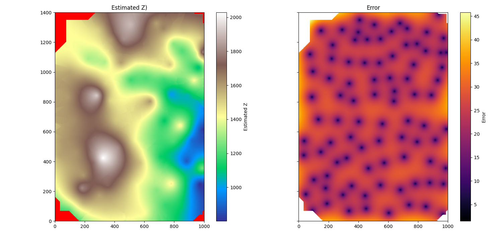


```bash
--> gp.contourd()
```

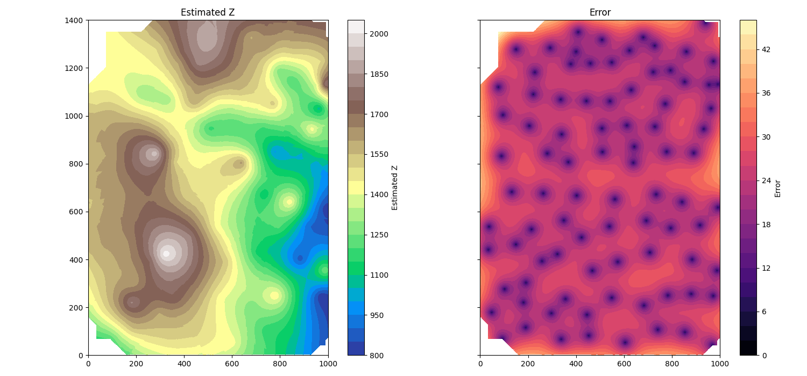

with `MtStHelens5000`

```bash
--> gp.contourc()
```
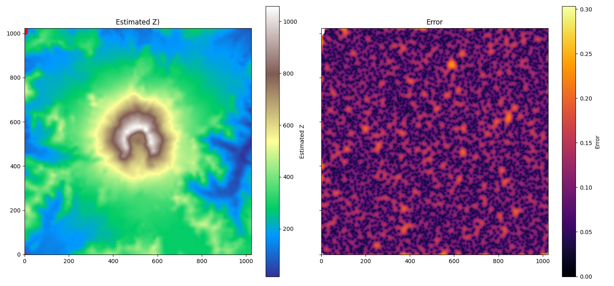

```bash
--> gp.contourd()
```

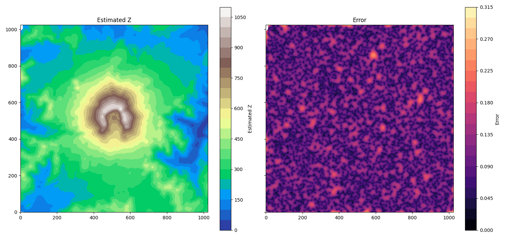

### Surfaces

`montebea` case:

```bash
--> gp.zsurf()
```

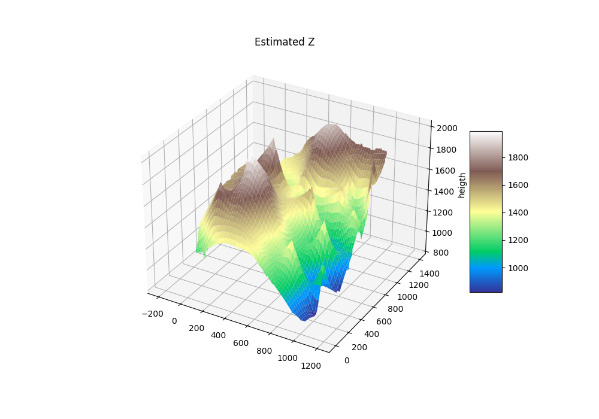

```bash
--> gp.esurf()
```

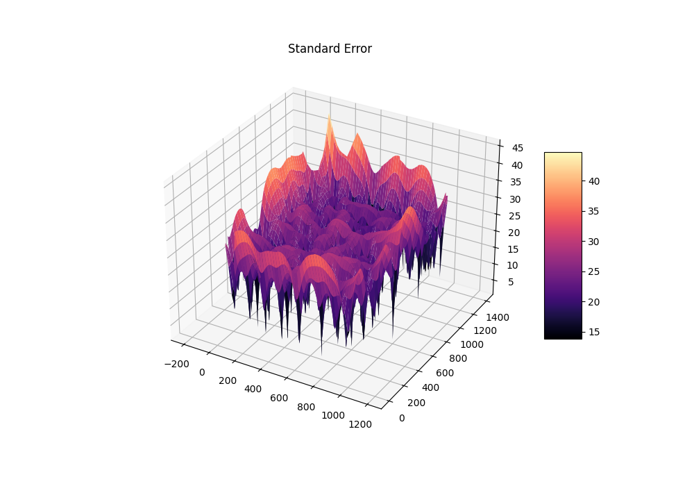

### GPU accelerated surface

If you have a GPU and a WebGL-compatible browser, you can benefit from a more dynamic, photorealistic view of the surface. The following command should open a tab in your browser displaying the surface:

```bash
--> gp.zsurf_gpu()
```

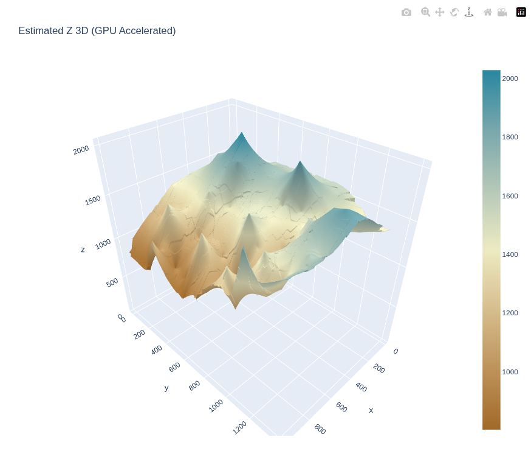

If you are using a Raspberry Pi and accessing it via VNC, you should use:

```bash
--> gp.zsurf_gpu_PI()
```
instead since it is optimized for such a situation.

You can also save the surface es a `html` file:

```bash
--> gp.save_zsurf()
3D model successfully exported to: msh_3d_model.html
-->
```
[Click here to open a 500x500 grid interactive 3D model (13 MB WebGL)](https://jccsvq.github.io/pygeko/docs/web_models/msh_3d_500.html)


## CLI utilities

### `pygeko`


The `pygeko` command is a souped-up Python interpreter designed to make working with this package easier. It is especially recommended if, for example, you install the package using `pipx`. It attempts to replicate some of the most useful aspects of the Python interpreter's behavior, but with the `Kdata`, `Kgrid`, and `Gplot` classes pre-imported, as well as some other defined symbols.

```bash
$ pygeko -h
pyGEKO-Kriger 0.9.0 - Command Line Interface

Usage:
  pygeko                 Launch interactive REPL
  pygeko <script.py>     Execute a script
  pygeko -i <script.py>  Execute a script and stay in interactive mode
  pygeko -m <module>     Run a library module (e.g., pygeko.examples.msh_tune)
  pygeko --help          Show this message
```

### `lsgck`

List of information extracted from the `.gck` files present in a directory.

```bash
$ lsgck -h
usage: lsgck [-h] [-d DIR]

pyGEKO Utility: Scan directory for geospatial data.

options:
  -h, --help         show this help message and exit
  -d DIR, --dir DIR  Path to the directory to scan (default: current directory
                     ".")
```

### `png2csv`

Read a 16-bit PNG DEM, extract N random points and export to CSV. Its purpose is to create sample data for this package.

```bash
$ png2csv -h
usage: png2csv [-h] [-n SAMPLES] [-o OUTPUT] [-s SEED] [--no-viz] [--invert-y]
               input

Random sample generator for pyGEKO from 16-bit PNG DEMs.

positional arguments:
  input                 Path to the PNG DEM file.

options:
  -h, --help            show this help message and exit
  -n SAMPLES, --samples SAMPLES
                        Number of random samples to generate, defaults to
                        1000.
  -o OUTPUT, --output OUTPUT
                        Output CSV filename.
  -s SEED, --seed SEED  Random seed for reproducibility.
  --no-viz              Turn off the display of sample points.
  --invert-y            Invert the Y axis to match geographical orientation.
```

